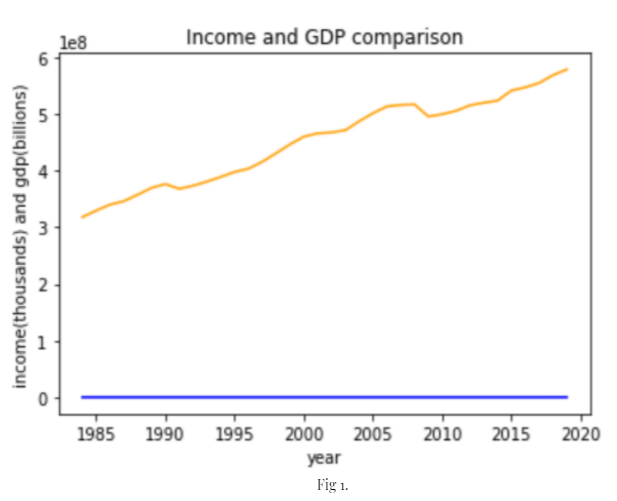
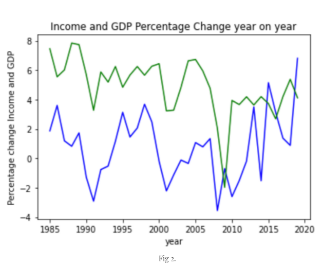
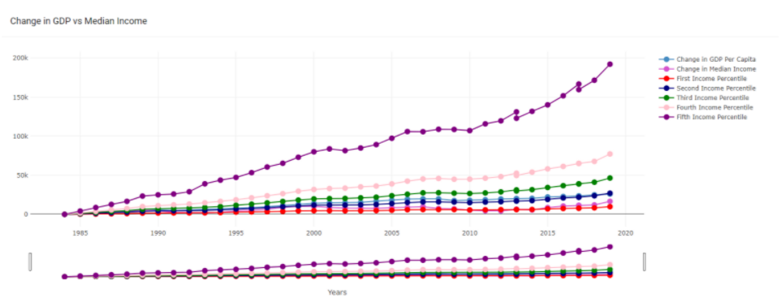
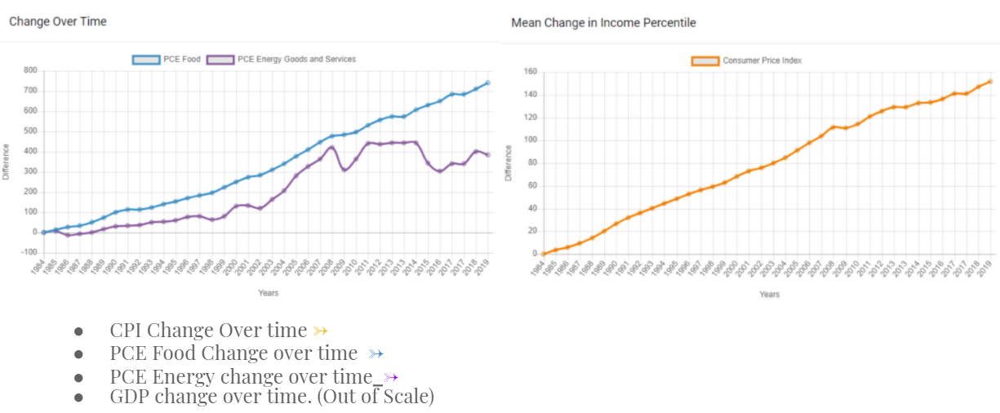
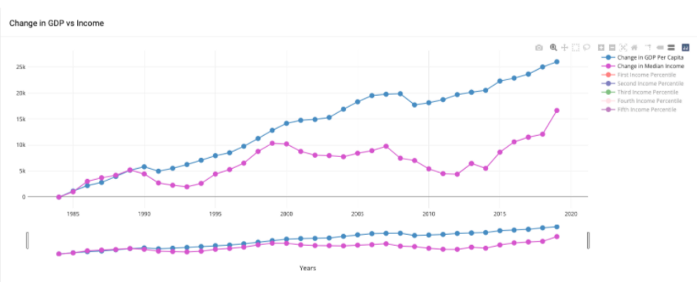

# Understanding Inequality Through Productivity and Income

## Why Inequality? 

Productivity and GDP have been steadily increasing for the last half century. Examining GDP, household expenses, and household income, this project seeks to understand whether those gains are being passed onto workers in the form of income. To add depth to the analysis, the project also includes consumer expenditures over time to demonstrate the full lifecycle of an American income. 

If you listen to Bernie Sanders, growing societal inequality is quite literally the end of civilization as we know it. But if you listen to Ronald Reagan and his contemporaries, wealth at  the top trickles down so we should add as much wealth to the top as possible.

Right now, we’re living in the most prosperous moment in human history. The amount of productivity, or goods/money/services produced in the United States right now is higher than it ever has been and we are the richest country in the history of humanity. 

Those trends haven’t changed in any of our lifetimes, but for some reason discussions about inequality are now mainstream. What’s going on here? Is it just that regular citizens are more attuned to economic discussions? Maybe, as a society we’re not just more prosperous but we’re also smarter than at any point in history as well. 

Our group wanted to dig deeper into those discussions and evaluate the data for ourselves. Our central question asks, is inequality increasing or decreasing over time relative to GDP and prices?

## Data Collecton and Cleanup 
To start we had datasets collected from Federal Reserve Economic Data (FRED), the Bureau of Labor Statistics, the US Census. 

* Real gross domestic product per capita (https://fred.stlouisfed.org/series/A939RX0Q048SBEA) 
* Real Median Household Income in the United States (https://fred.stlouisfed.org/series/MEHOINUSA672N)
* CPI for All Urban Consumers (https://data.bls.gov/timeseries/CUUR0000SA0)
* Personal consumption expenditures: Energy goods and services (https://fred.stlouisfed.org/series/     DNRGRC1M027SBEA)
* Historical Income Tables: Households (https://www.census.gov/data/tables/time-series/demo/income-poverty/historical-income-households.html)

Python was used to clean the data, turning strings into integers, renaming columns, and filtering so each dataset consisted of the same number of years. Datetime from Pandas was also imported to inflate the 2019 dollars to current dollars. 

In comparing our data, we had a challenge in fidning a meaningful way to visualize out findings. If we compared  GDP or Consumer Price Expenditures in billions of dollars with income in thousands of dollars didn’t really create a meaningful visualization.  Basically what you can see IN FIG 1 is that while GDP rises, income stays at about a 0 slope

We also calculated the percentage change over time, so that the graphs would be on the same scale, but that too, was not the right way to interpret the data because it’s too extrapolated, calculating the percentage change of the percentage change. 

After trying to model our data in different ways, in the end we decided to follow FRED and other economic data groups and compare the difference change year on year, which would allow our datasets to be more comparable and start at zero. 

## Project Setup 

Languages and Libraries: 

* Python Language 
* PostgresSQL 
* SQL Alchemy 
* Javascript
* HTML
* CSS 
* Plotly
* Charts.js

 

The above Plotly chart of the different income percentiles was the largest because this data was the most relevant and we wanted to reader’s attention to focus here. Since the data goes from 1984 to 2019, we also added a slider for this chart to allow the reader to zoom in or out of a range of years.

 

 The charts were loaded as json with D3.js using the Flask API. The data was pulled from the json and connected to the plotly and chartsjs functions to create these line graphs. The legends allow
Us to choose which variables we want to compare by eliminating GDP, Median Income, GDP Per Capita.

## Findings
Although we were able to draw out a few conclusions with our data set, there are some that stuck out.
* American median income stagnated from 2000 onwards
* Lower percentiles saw their incomes increase at a slower rate than the incomes of higher percentiles
* Median income is upward trending since 2008

 

## Post Mortem 

Although we were able to make out conclusions from our data, there are further action iteams we will be looking to add in the coming weeks. 

1) Further Develop the Dataset - With the added time, we will be digging deeper into our dataset to analyze and drive out more inferences. 
2) More Data - With more data, we hope to find more relevant points, and extend our data timeframe to include the years of The Great Depression to see how the economy bounced back after that since we’re only starting to observe the rise of the economy following the 2008 financial crisis.
3) Forecasting - We want to be able to relate this back to any individual accessing our dashboard. How much you’re earning now is an integral part of managing finances, investments, future spending. We would like to project the outlook of these aspects of your life solely based on your current income as an input so it can be used not just as an informational dashboard but a functional planning tool.
4) More Questions - How much inequality is tolerable? The final central question that came out of this project is, whether or not inequality is truly truly bad? Regardless of political views, how much should we pay attention to the ability to raise one’s economy given that it does not damage the livelihood of others.

With these additions, we will be able to present additional visualizations and further analyze the differences between the Great Recession and the 2008 crisis. 

## Attribution Link 

Dashboard Template used : https://github.com/gurayyarar/AdminBSBMaterialDesign

 

